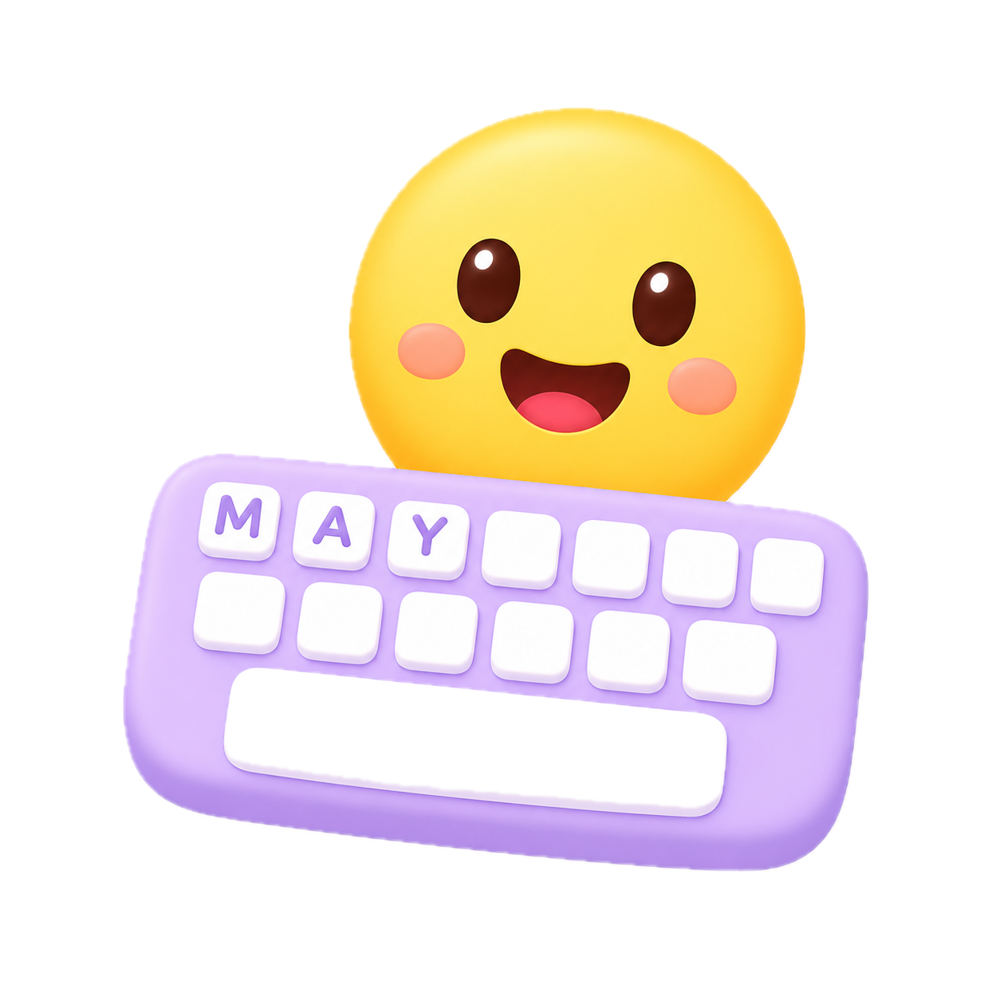

แอปฝึกสนทนาภาษาอังกฤษกับ AI Agent ในสถานการณ์จำลอง พร้อมตรวจแกรมม่า จัดการคลังคำศัพท์ และติดตามพัฒนาการ


---

## 📱 Overview

Vibe Talk เป็นแอปที่ช่วยให้คุณฝึกภาษาอังกฤษผ่านการสนทนากับ AI โดยจำลองสถานการณ์จริงในชีวิตประจำวัน ตัว AI จะตอบโต้เหมือนคนจริง พร้อมช่วยแก้ไขแกรมม่าให้แบบเรียลไทม์

### 🏠 Chat — หน้าแรก
```
┌─────────────────────────────┐
│  📋 เลือกสถานการณ์          │
│  [🍔 สั่งอาหาร] [💼 สัมภาษณ์] │
│  [🏨 โรงแรม]   [💬 คุยเล่น]  │
│                              │
│  ┌─────────────────────┐     │
│  │ 👩‍💼 AI: How can I    │     │
│  │    help you today?  │     │
│  └─────────────────────┘     │
│      ┌─────────────────┐     │
│      │ 😊 You: I'd like│     │
│      │ to order a pizza│     │
│      └─────────────────┘     │
│  ┌─────────────────────┐     │
│  │ 🔍 Grammar Tips:    │     │
│  │ ✅ "I'd like" (ถูก!) │     │
│  └─────────────────────┘     │
│                              │
│  [💬 พิมพ์ข้อความ...      📤] │
└─────────────────────────────┘
```

- 🎭 **8 สถานการณ์** — สั่งอาหาร, สัมภาษณ์งาน, เช็คอินโรงแรม, Small Talk, ช้อปปิ้ง, ถามทาง, ไปหาหมอ, คุยอิสระ
- 🔍 **ตรวจแกรมม่า** — จับผิดและแก้ไข Tense, Preposition, Article, Word Order ฯลฯ พร้อมคำอธิบายภาษาไทย
- 📝 **เก็บประวัติ** — บทสนทนาทั้งหมดถูกบันทึกใน IndexedDB เรียกดูย้อนหลังได้

### 📊 Dashboard — สถิติ
```
┌─────────────────────────────┐
│  📊 Error Dashboard         │
│  แชท 12 ครั้ง · ผิด 45 จุด  │
│                              │
│  ██████████ Tense      15   │
│  ██████     Preposition 9   │
│  ████       Article     6   │
│  ███        Word Order  5   │
│  ██         S-V Agree   4   │
│  ██         Word Choice 3   │
│  █          Spelling    2   │
│  █          Other       1   │
└─────────────────────────────┘
```

- 📈 แสดงสถิติข้อผิดพลาดแยกตามประเภท พร้อม Progress Bar
- 🔄 อัปเดต real-time หลังทุกบทสนทนา

### 📚 Vocabulary — คลังคำศัพท์
```
┌─────────────────────────────┐
│  📚 Vocabulary        [+]   │
│  🔍 ค้นหาคำศัพท์...         │
│  ████████░░ รู้แล้ว 8/12    │
│  [ทั้งหมด] [ยังไม่รู้] [รู้แล้ว]│
│  [ชีวิต] [อาหาร] [ท่องเที่ยว] │
│                              │
│  ┌─────────────────────┐     │
│  │        1 / 12        │     │
│  │  ✏️ 🗑️ 👁️ [✅ รู้แล้ว] │     │
│  │                      │     │
│  │   serendipity 🔊     │     │
│  │  /ˌserənˈdɪpəti/    │     │
│  │       [ n. ]         │     │
│  │                      │     │
│  │  ความหมาย:            │     │
│  │  การค้นพบสิ่งดีๆ...    │     │
│  │                      │     │
│  │  💬 Example:         │     │
│  │  Finding that café   │     │
│  │  was pure serendipity│     │
│  └─────────────────────┘     │
│  [◀ ก่อนหน้า] [ถัดไป ▶]     │
└─────────────────────────────┘
```

- ✨ **AI Auto-fill** — ใส่แค่คำศัพท์ AI เติมคำอ่าน, ความหมาย, Part of Speech, หมวดหมู่, ตัวอย่างประโยคให้อัตโนมัติ
- ✅ **Spell Check** — ตรวจสอบการสะกดก่อนบันทึก ถ้าสะกดผิดมีคำแนะนำให้เลือก
- 🚫 **Duplicate Detection** — แจ้งเตือนเมื่อเพิ่มคำซ้ำ ป้องกันข้อมูลซ้ำซ้อน
- 🔍 **ค้นหา** — ค้นหาจากคำศัพท์หรือความหมายภาษาไทย
- 🔊 **ฟังเสียง** — Text-to-Speech อ่านคำศัพท์ให้ฟัง
- 📂 จัดหมวดหมู่ 13 ประเภท + กรองรู้แล้ว/ยังไม่รู้

### ⚙️ Settings
```
┌─────────────────────────────┐
│  ⚙️ Settings                │
│                              │
│  🔑 DeepSeek API Key        │
│  ┌─────────────────────┐     │
│  │ sk-xxxxxxxxxxxxxxxx │     │
│  └─────────────────────┘     │
│  [💾 บันทึก]                  │
│                              │
│  ℹ️ ต้องใช้ API Key จาก       │
│  platform.deepseek.com      │
│  เพื่อใช้งาน AI Chat          │
└─────────────────────────────┘
```

- ตั้งค่า DeepSeek API Key (เก็บบน browser เท่านั้น)

### 📱 PWA
- ติดตั้งลงหน้าจอมือถือได้ (iOS/Android)
- ใช้งานแบบ Full Screen (standalone mode)
- รองรับ Safe Area บน iPhone รุ่นมีรอยบาก

---

## 🛠 Tech Stack

| ด้าน | เทคโนโลยี |
|---|---|
| Framework | Next.js 15 (App Router) |
| Language | TypeScript |
| Styling | Tailwind CSS (โทนกาแฟพาสเทล) |
| AI | DeepSeek API (OpenAI SDK) |
| Storage | IndexedDB (via `idb`) |
| PWA | `next-pwa` |
| Icons | Lucide React |

---

## 🚀 Getting Started

```bash
# ติดตั้ง dependencies
npm install

# รัน development server
npm run dev

# build สำหรับ production
npm run build
```

### การตั้งค่า API Key

1. เปิดแอป → ไปที่หน้า **Settings**
2. ใส่ DeepSeek API Key (สมัครได้ที่ [platform.deepseek.com](https://platform.deepseek.com))
3. API Key เก็บใน `localStorage` (ฝั่ง browser เท่านั้น ไม่ส่งไป server)

---

## 📁 Project Structure

```
src/
├── app/
│   ├── page.tsx              # Chat หน้าแรก
│   ├── dashboard/page.tsx    # Error Dashboard
│   ├── vocabulary/page.tsx   # คลังคำศัพท์
│   ├── settings/page.tsx     # ตั้งค่า API Key
│   ├── layout.tsx            # Root Layout
│   ├── manifest.ts           # PWA Manifest
│   └── globals.css           # Global styles + animations
├── components/
│   ├── ChatBubble.tsx        # ฟองแชท
│   ├── ChatInput.tsx         # ช่องพิมพ์ข้อความ
│   ├── ConversationList.tsx  # รายการบทสนทนา
│   ├── VocabularyCard.tsx    # การ์ดคำศัพท์
│   ├── AddWordModal.tsx      # Modal เพิ่ม/แก้ไขคำศัพท์
│   ├── BottomNav.tsx         # แถบนำทางด้านล่าง
│   ├── PhoneFrame.tsx        # กรอบโทรศัพท์ (Desktop)
│   ├── ScenarioSelector.tsx  # เลือกสถานการณ์
│   ├── CorrectionCard.tsx    # แสดงคำแก้ไขแกรมม่า
│   ├── ErrorDashboard.tsx    # แสดงสถิติข้อผิดพลาด
│   └── SettingsPanel.tsx     # ตั้งค่า
├── hooks/
│   └── useVocabulary.ts      # จัดการคลังคำศัพท์
└── lib/
    ├── deepseek.ts           # DeepSeek API client
    ├── db.ts                 # IndexedDB operations
    ├── types.ts              # TypeScript types
    └── oxford3000.ts         # ข้อมูล Oxford 3000 (อ้างอิง)
```

---

## 📄 License

MIT
