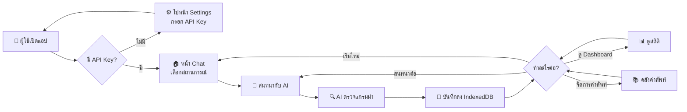
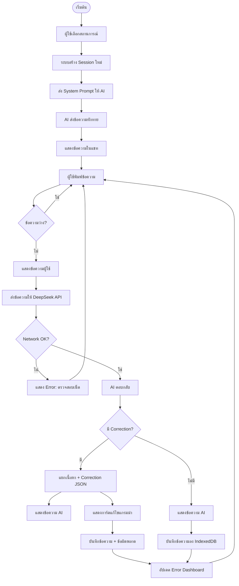
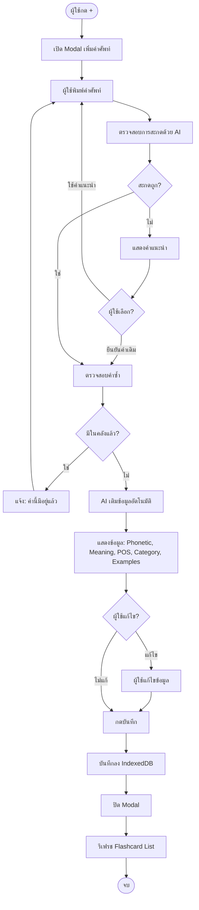
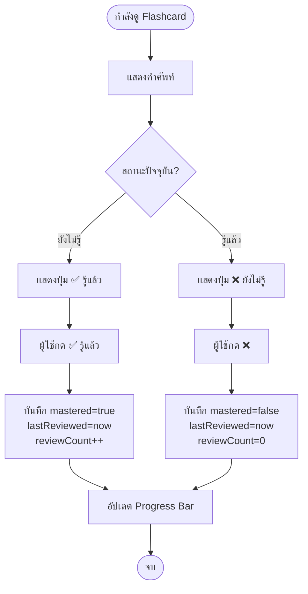
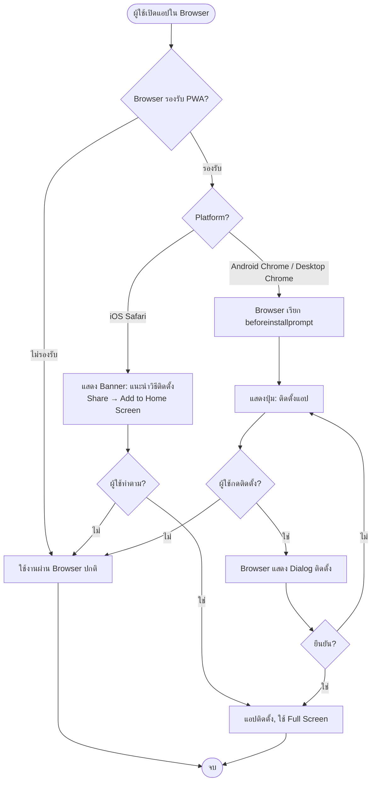
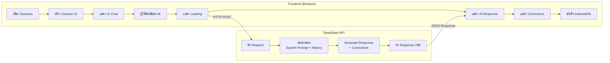
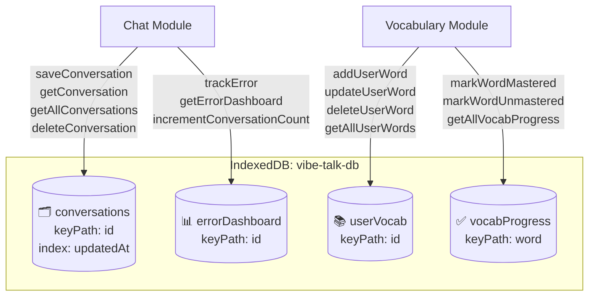

# 🔄 BPMN / Process Flow

| ฟิลด์ | รายละเอียด |
|---|---|
| **ชื่อโปรเจกต์** | Vibe Talk — แอปฝึกสนทนาภาษาอังกฤษด้วย AI |
| **เวอร์ชัน** | 1.0 |
| **วันที่จัดทำ** | 3 กุมภาพันธ์ 2568 |
| **ผู้จัดทำ** | ทีม Business Analyst |

---

## 1. ภาพรวมกระบวนการทางธุรกิจ (High-Level Process)

---

## 2. Process Flow: การสนทนากับ AI (Chat Flow)

---

## 3. Process Flow: การเพิ่มคำศัพท์ (Add Vocabulary)

---

## 4. Process Flow: การทำเครื่องหมายรู้แล้ว/ยังไม่รู้ (Mastery Tracking)

---

## 5. Process Flow: ติดตั้ง PWA (Installation)

---

## 6. Cross-Functional Flow: Session Lifecycle

---

## 7. Data Flow: ข้อมูลใน IndexedDB

---

## เอกสารอ้างอิง

| เอกสาร | ลิงก์ |
|---|---|
| BRD | [01-brd.md](./01-brd.md) |
| FRD | [02-frd.md](./02-frd.md) |
| Use Case Spec | [05-use-case-spec.md](./05-use-case-spec.md) |
| UML Diagrams | [08-uml.md](./08-uml.md) |
