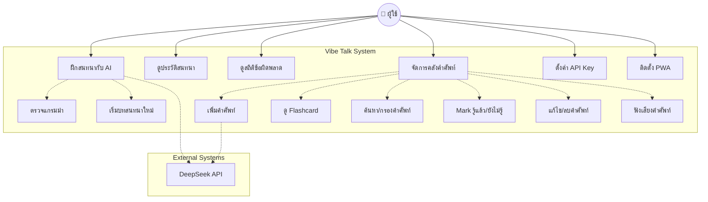
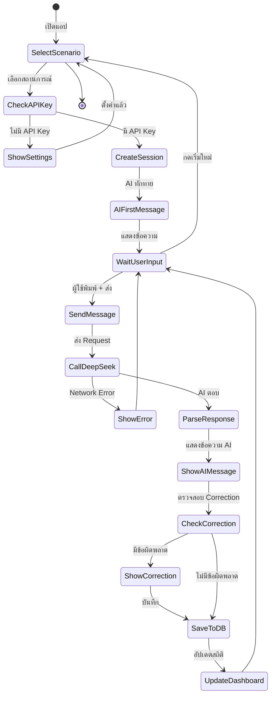
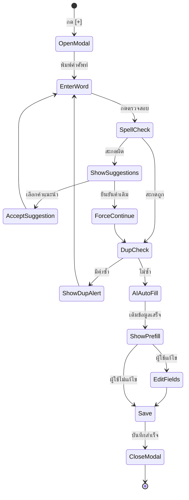
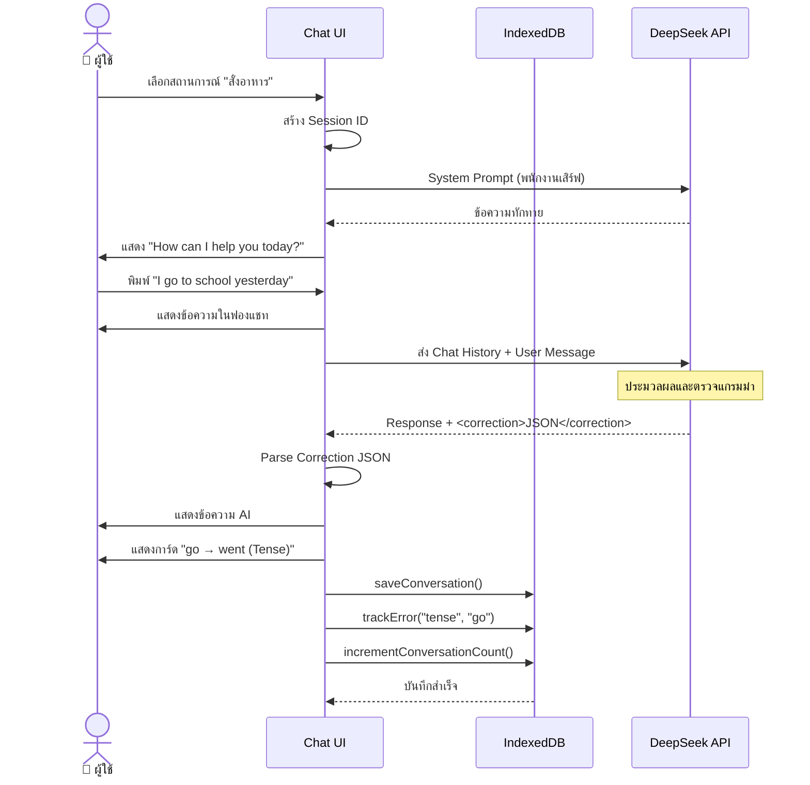
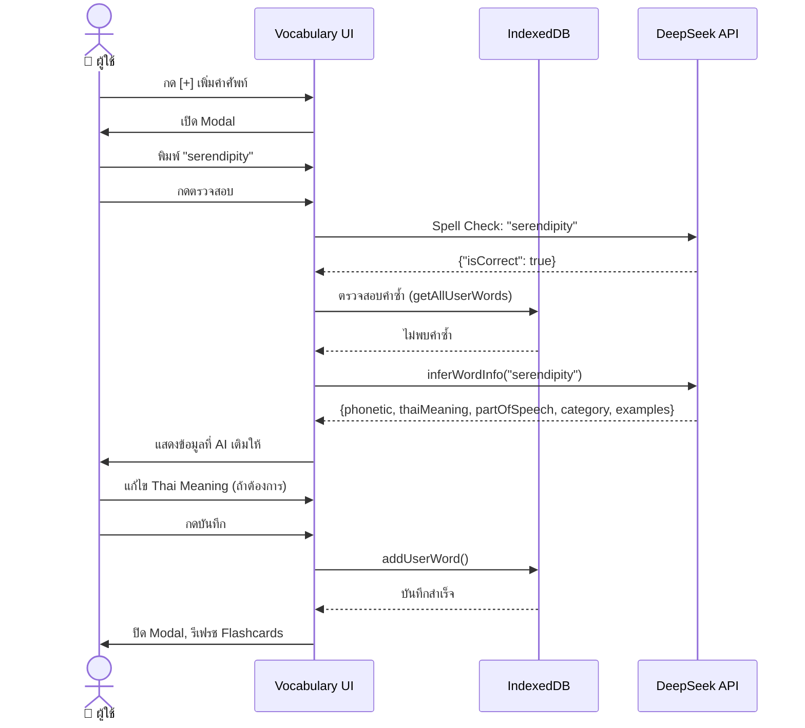
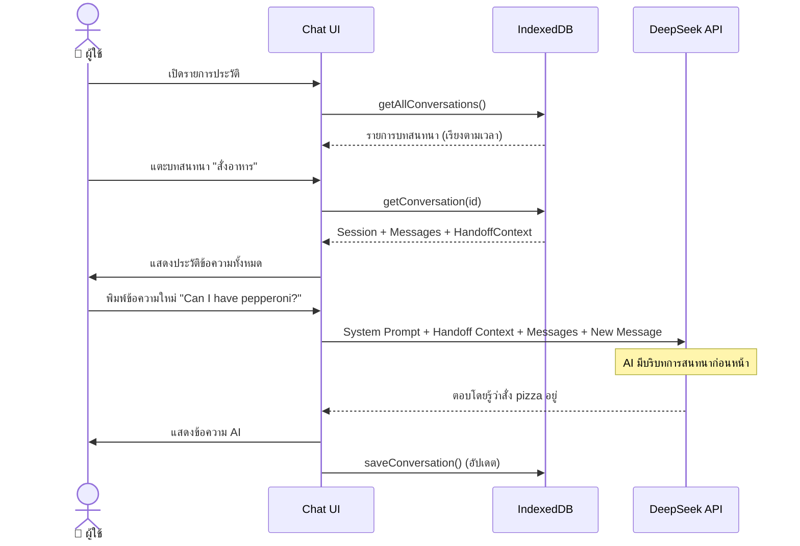
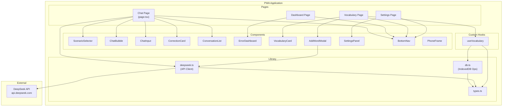
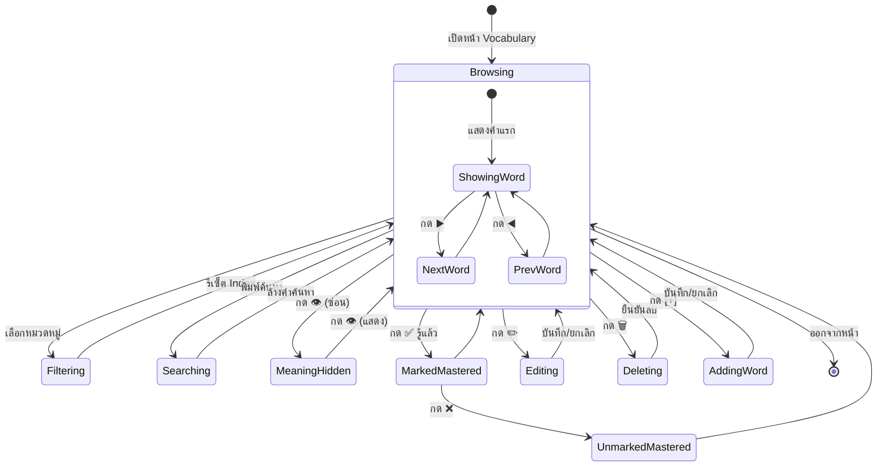
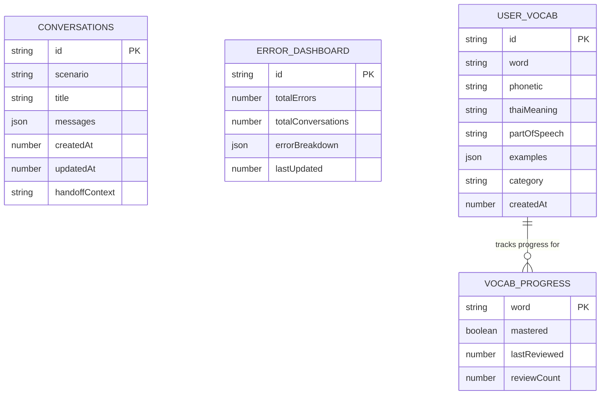

# 📐 UML Diagrams

| ฟิลด์ | รายละเอียด |
|---|---|
| **ชื่อโปรเจกต์** | Vibe Talk — แอปฝึกสนทนาภาษาอังกฤษด้วย AI |
| **เวอร์ชัน** | 1.0 |
| **วันที่จัดทำ** | 7 กุมภาพันธ์ 2568 |
| **ผู้จัดทำ** | ทีม Business Analyst |

---

## 1. Use Case Diagram

---

## 2. Activity Diagram: Chat Flow

---

## 3. Activity Diagram: Add Vocabulary

---

## 4. Sequence Diagram: Chat with Grammar Correction

---

## 5. Sequence Diagram: Add Vocabulary with AI Auto-fill

---

## 6. Sequence Diagram: Resume Conversation (Handoff)

---

## 7. Component Diagram (High-Level Architecture)

---

## 8. State Diagram: Vocabulary Card Lifecycle

---

## 9. Entity Relationship Diagram (IndexedDB)

---

## เอกสารอ้างอิง

| เอกสาร | ลิงก์ |
|---|---|
| BRD | [01-brd.md](./01-brd.md) |
| FRD | [02-frd.md](./02-frd.md) |
| Use Case Spec | [05-use-case-spec.md](./05-use-case-spec.md) |
| BPMN / Process Flow | [06-bpmn.md](./06-bpmn.md) |
| Wireframe | [07-wireframe.md](./07-wireframe.md) |
