# 💳 Payment Gateway Integration — Sequence, State & Edge Cases

| ฟิลด์ | รายละเอียด |
|---|---|
| **ชื่อโปรเจกต์** | Vibe Talk — แอปฝึกสนทนาภาษาอังกฤษด้วย AI |
| **เวอร์ชัน** | 2.0 (Payment Integration) |
| **วันที่จัดทำ** | 15 กรกฎาคม 2569 |
| **ผู้จัดทำ** | ทีม Business Analyst |
| **สถานะ** | Draft — รอ Review |

---

## 1. Business Context: ทำไมต้องมี Payment?

ปัจจุบัน Vibe Talk ให้ผู้ใช้ **นำ API Key ของตัวเองมาใช้** (Bring Your Own Key) ซึ่งมี Pain Points:
- ผู้ใช้ต้องสมัคร DeepSeek ด้วยตัวเอง (แรงเสียดทานสูง)
- ผู้ใช้ต้องจัดการบัตรเครดิต/เติมเงินกับ DeepSeek โดยตรง
- ไม่มี Revenue Stream สำหรับ Vibe Talk

**Payment Gateway จะเปลี่ยนโมเดลเป็น:**
- Vibe Talk จัดการ API Key ฝั่ง Server (ผู้ใช้ไม่ต้องมี Key เอง)
- ผู้ใช้เลือก **แพ็กเกจ** (ตามจำนวนข้อความ/โทเค็น) หรือ **Subscription รายเดือน**
- Vibe Talk เป็นตัวกลาง รับเงิน → จ่ายค่า API ให้ DeepSeek

### Pricing Model (Proposed)

| แพ็กเกจ | ราคา | จำนวนข้อความ | เหมาะสำหรับ |
|---|---|---|---|
| Free | 0 บาท | 50 ข้อความ/เดือน | ทดลองใช้งาน |
| Basic | 99 บาท/เดือน | 500 ข้อความ/เดือน | ผู้ใช้ทั่วไป |
| Pro | 199 บาท/เดือน | 2,000 ข้อความ/เดือน | ใช้งานหนัก |
| One-time Boost | 49 บาท | 200 ข้อความ (ไม่มีวันหมดอายุ) | ใช้งานชั่วคราว |

---

## 2. Architecture Change: Client-Only → Client + Backend

### Before (v1.0 — No Payment)

```
Browser (PWA) ──────> DeepSeek API (ตรง)
         │
         └── IndexedDB (local)
```

### After (v2.0 — With Payment)

```
                          ┌─────────────────────────┐
                          │    Payment Gateway       │
                          │  Omise / 2C2P / Stripe  │
                          └──────────┬──────────────┘
                                     │ Webhook
┌──────────────┐    HTTP     ┌───────▼────────┐    API Key    ┌──────────────┐
│  Browser     │ ──────────> │  Vibe Talk     │ ────────────> │  DeepSeek    │
│  (PWA)       │ <────────── │  Backend       │ <──────────── │  API         │
│              │             │  (Next.js API) │               │              │
│  IndexedDB   │             │                │               └──────────────┘
│  (local)     │             │  PostgreSQL /  │
└──────────────┘             │  Supabase      │
                             └────────────────┘
```

**สิ่งที่เพิ่มเข้ามา:**
- **Next.js API Routes** (หรือแยก Backend Service)
- **Database** (PostgreSQL/Supabase) สำหรับ: User, Payment Transactions, Token Balance, Subscription
- **Auth System** (Simple JWT หรือ NextAuth) — จำเป็นเพราะต้องระบุตัวตนก่อนจ่ายเงิน
- **Payment Gateway** (Omise แนะนำสำหรับตลาดไทย)

---

## 3. Sequence Diagram: การซื้อแพ็กเกจ (Happy Path)

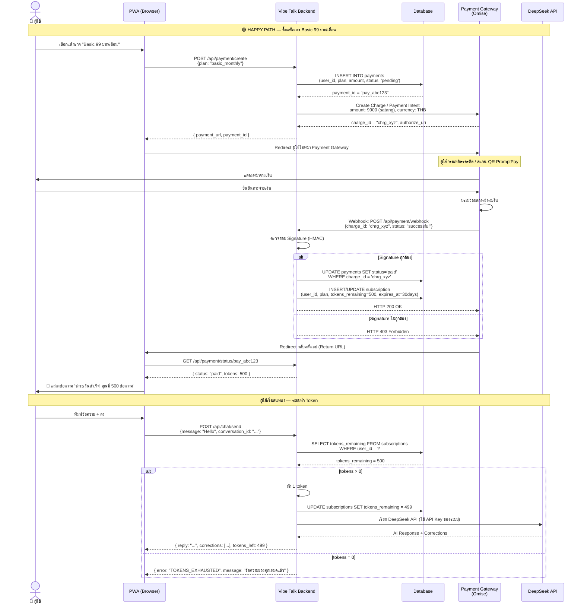

---

## 4. Sequence Diagram: Edge Cases ทั้งหมด

### 4a. ผู้ใช้ยกเลิกก่อนจ่ายเงิน (Payment Abandoned)

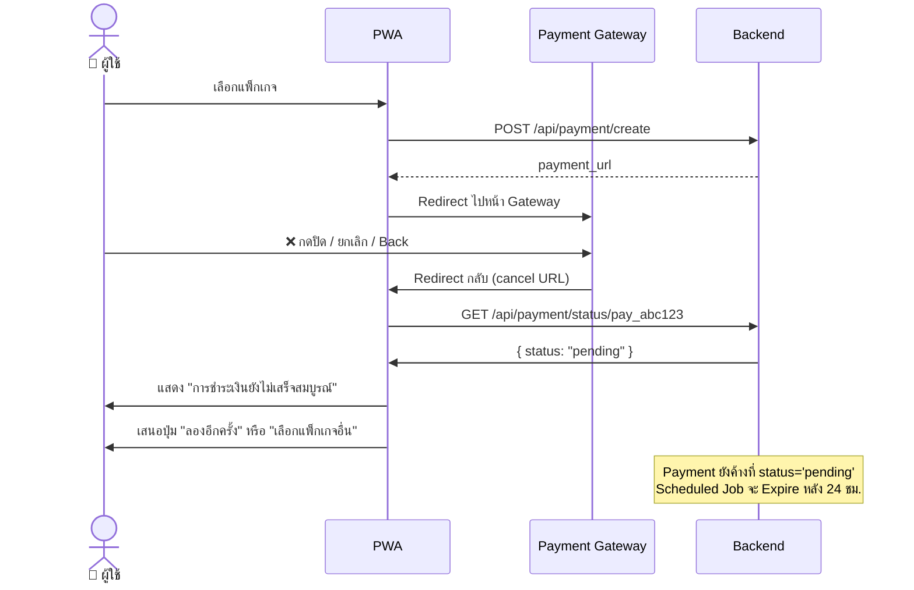

### 4b. จ่ายเงินสำเร็จ แต่ Webhook มาช้า / ไม่มา (Webhook Latency / Missing)

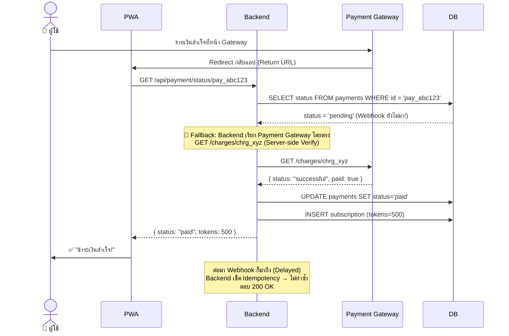

### 4c. จ่ายเงินสำเร็จ แต่ Backend Error ตอนเติม Token (Partial Failure)

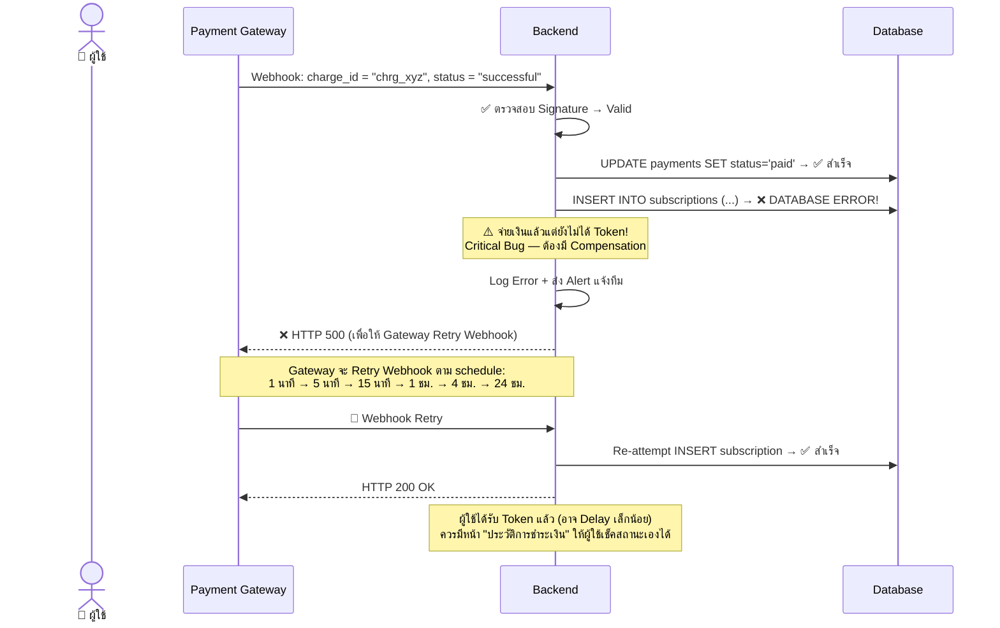

### 4d. จ่ายเงินไม่สำเร็จ — บัตรถูกปฏิเสธ (Payment Declined)

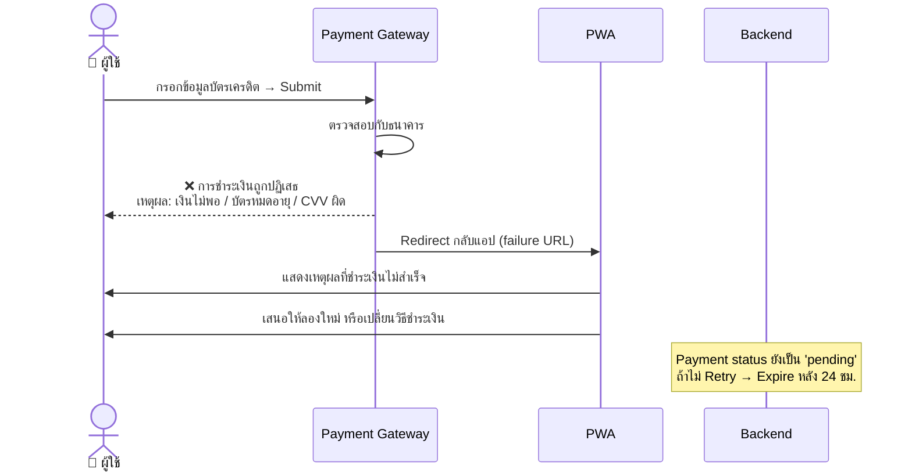

### 4e. จ่ายเงินซ้ำซ้อน (Duplicate Payment / Double Click)

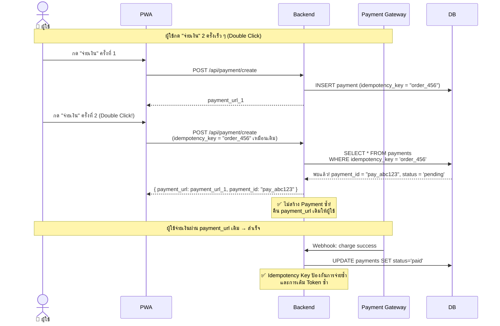

### 4f. ผู้ใช้ขอ Refund / Chargeback

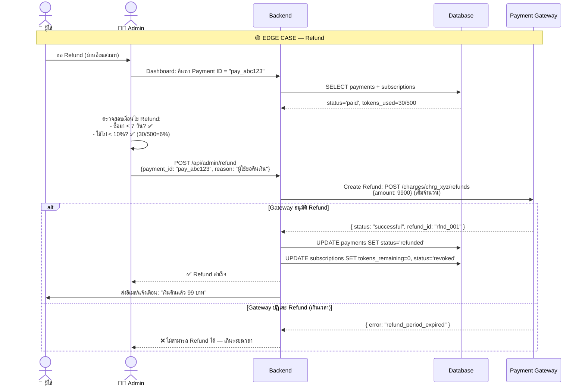

### 4g. Subscription Renewal ล้มเหลว (Recurring Payment Failed)

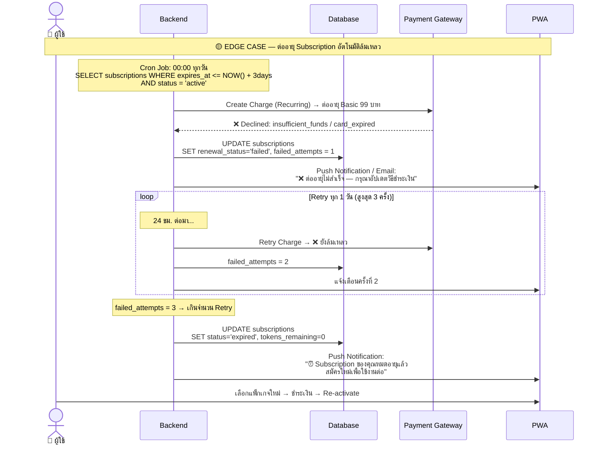

---

## 5. State Diagram: Payment Lifecycle

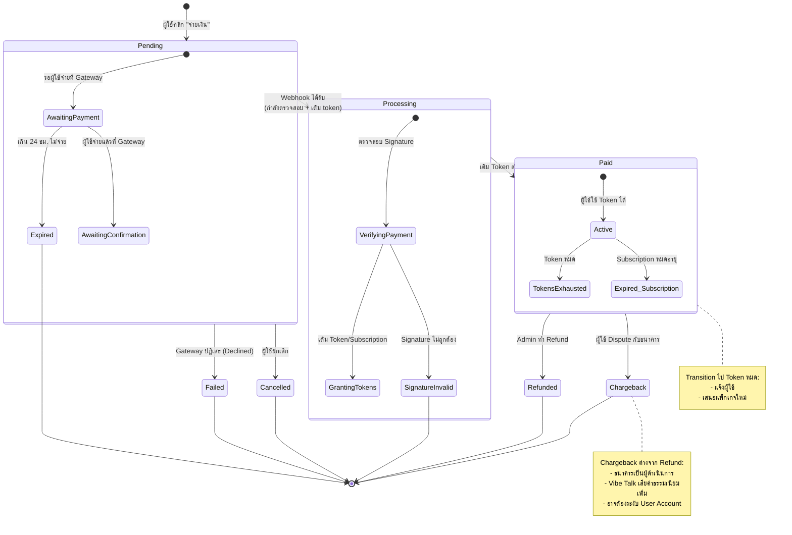

---

## 6. State Diagram: Subscription Lifecycle

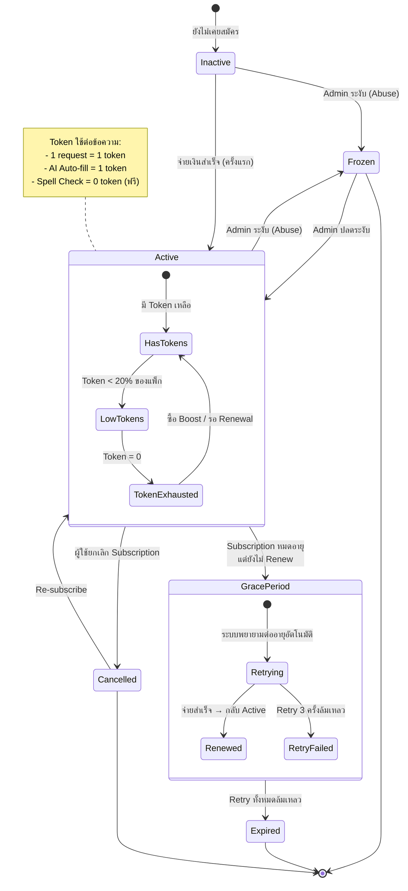

---

## 7. Happy Path & Edge Cases — สรุปตาราง

### 7.1 Happy Path

| # | Scenario | Trigger | Flow | Expected Outcome |
|---|---|---|---|---|
| HP-01 | ซื้อแพ็กเกจครั้งแรก | ผู้ใช้เลือกแพ็กเกจ + จ่ายเงินสำเร็จ | Create Payment → Redirect Gateway → Pay → Webhook → Grant Tokens | ผู้ใช้ได้ Token ตามแพ็กเกจ ใช้งาน AI ได้ทันที |
| HP-02 | ต่ออายุ Subscription อัตโนมัติ | Cron Job ตรวจ到期 | Charge Recurring → Success → Reset Token → Extend expires_at | ต่ออายุสำเร็จ ผู้ใช้ไม่ต้องทำอะไร |
| HP-03 | ซื้อ Boost เพิ่มระหว่างรอบ | ผู้ใช้กด "เติมข้อความ" | Create Boost Payment → Pay → Add Tokens to existing subscription | Token เพิ่มใน subscription ปัจจุบัน |
| HP-04 | ดูประวัติการจ่ายเงิน | ผู้ใช้เปิด Billing History | GET /api/payment/history | เห็นรายการ: วันที่, แพ็กเกจ, จำนวนเงิน, สถานะ |

### 7.2 Edge Cases

| # | Scenario | Severity | Mitigation |
|---|---|---|---|
| EC-01 | **Webhook ไม่มา** (Network Issue ฝั่ง Gateway) | 🔴 Critical | **Server-side Verify**: หลัง Redirect กลับแอป Backend เรียก Gateway โดยตรง (`GET /charges/:id`) เพื่อยืนยันสถานะ |
| EC-02 | **จ่ายเงินแล้วแต่เติม Token ไม่ได้** (DB Error) | 🔴 Critical | **Webhook Retry**: ตอบ 500 ให้ Gateway Retry. มี Idempotency Key เพื่อป้องกันการเติมซ้ำ. ถ้ายังล้มเหลว → Manual Intervention |
| EC-03 | **Double Click จ่ายเงิน** | 🟡 Major | **Idempotency Key**: Backend ตรวจสอบ `idempotency_key` ก่อนสร้าง Payment ใหม่ → คืน payment_url เดิม |
| EC-04 | **Webhook มาหลังจาก Refund แล้ว** | 🟡 Major | ตรวจสอบ Payment Status ก่อนดำเนินการใด ๆ — ถ้า status='refunded' แล้ว → Ignore Webhook |
| EC-05 | **Subscription Renewal ล้มเหลว** (บัตรหมดอายุ) | 🟡 Major | Retry สูงสุด 3 ครั้ง ห่างกัน 24 ชม. + แจ้งเตือนผู้ใช้. หลัง Retry หมด → Expire Subscription |
| EC-06 | **Gateway Timeout** (ผู้ใช้รอนานแล้วไม่ตอบ) | 🟡 Major | แสดง Loading + "กำลังดำเนินการ" พร้อม Timeout 60 วิ → แจ้งให้ผู้ใช้เช็คอีเมลหรือประวัติการชำระเงินภายหลัง |
| EC-07 | **ผู้ใช้ Dispute / Chargeback** | 🔴 Critical | ตรวจสอบหลักฐาน + โต้แย้งกับธนาคาร. ระหว่าง Dispute → Freeze User Account. แยก Log สำหรับ Finance Team |
| EC-08 | **Token หมดกลางบทสนทนา** | 🟢 Minor | ตรวจสอบ Token **ก่อน**เรียก AI → ถ้าเหลือ 0: แจ้งผู้ใช้ + แสดงปุ่ม "เติมข้อความ" |
| EC-09 | **Token เกือบหมด** (Threshold < 20%) | 🟢 Minor | แสดง Banner เตือน: "คุณเหลือข้อความอีก 10 ข้อความ" + ปุ่มเติม |
| EC-10 | **ผู้ใช้ต้องการเปลี่ยนแพ็กเกจกลางรอบ** | 🟡 Major | Prorated Calculation: คำนวณส่วนต่าง + คืนเงิน/เรียกเก็บเพิ่ม → เปลี่ยนแพ็กเกจ |
| EC-11 | **VPN / Proxy จ่ายเงิน** (Fraud Risk) | 🟡 Major | Gateway มักมี Fraud Detection ในตัว. Backend เพิ่ม Rate Limiting: สร้าง Payment ได้ไม่เกิน 3 ครั้ง/วัน |
| EC-12 | **ผู้ใช้ลบ Browser Cache → Token หาย?** | 🟢 Minor | Token เก็บฝั่ง Server (Database) — ไม่ผูกกับ Browser. ผู้ใช้ Login ใหม่ก็เห็น Token เท่าเดิม |

---

## 8. Prorated Calculation: เปลี่ยนแพ็กเกจกลางรอบ

```
ตัวอย่าง: ผู้ใช้สมัคร Basic (99 บาท/เดือน) เมื่อ 1 ก.ค.
         15 ก.ค. ต้องการอัปเกรดเป็น Pro (199 บาท/เดือน)

Step 1: คำนวณมูลค่าคงเหลือของแพ็กเกจเดิม
  Basic 99 บาท / 30 วัน = 3.30 บาท/วัน
  ใช้ไปแล้ว 15 วัน → เหลือ 15 วัน
  มูลค่าคงเหลือ = 15 × 3.30 = 49.50 บาท

Step 2: คำนวณมูลค่าที่ต้องจ่ายสำหรับแพ็กเกจใหม่ (เต็มเดือน)
  Pro 199 บาท

Step 3: ส่วนต่างที่ต้องจ่ายเพิ่ม
  199 - 49.50 = 149.50 บาท

Step 4: สร้าง Payment 149.50 บาท
  → จ่ายเงิน → เปลี่ยนเป็น Pro → Reset 30 วันนับจากวันนี้ → Token = 2,000
```

---

## 9. Database Schema (Proposed)

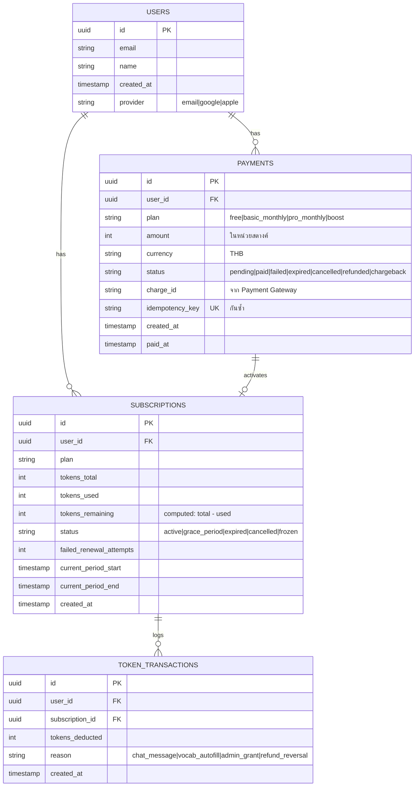

---

## 10. Security Considerations

| ด้าน | รายละเอียด |
|---|---|
| **API Key** | DeepSeek API Key เก็บฝั่ง Backend เท่านั้น (Environment Variable) — ไม่ expose ให้ Client |
| **Webhook Signature** | ตรวจสอบ HMAC Signature ทุก Webhook Request — ป้องกัน Fake Webhook |
| **PCI Compliance** | ไม่เก็บบัตรเครดิตเอง — ใช้ Payment Gateway Tokenization (Omise Token API) |
| **HTTPS** | ทุก Endpoint ใช้ HTTPS |
| **Idempotency** | Idempotency Key ทุก Payment Creation + Webhook Handling |
| **Rate Limiting** | จำกัดการสร้าง Payment 3 ครั้ง/วัน/User |
| **Auth** | ทุก API ต้องมี JWT Token — Middleware ตรวจสอบก่อน allow |

---

## 11. ไฟล์ที่ต้องอัปเดตเมื่อมี Payment

หากนำ Payment Gateway มาใช้จริง เอกสาร BA เดิมที่ต้องอัปเดต:

| เอกสาร | สิ่งที่ต้องเพิ่ม |
|---|---|
| `01-brd.md` | Business Model & Revenue Stream, Pricing Strategy |
| `02-frd.md` | FR-M08: Payment Module (7-8 Requirements ใหม่) |
| `03-user-stories.md` | Epic 7: Payment & Subscription (~6 User Stories) |
| `04-acceptance-criteria.md` | AC สำหรับ Payment, Subscription, Token Management |
| `05-use-case-spec.md` | UC-07: Purchase Plan, UC-08: Manage Subscription |
| `06-bpmn.md` | Payment Process Flow |
| `08-uml.md` | เพิ่ม Use Case Diagram, Component Diagram (Backend) |
| `09-rtm.md` | Trace Payment FR → Design → Dev → Test |
| `10-uat.md` | UAT Test Cases สำหรับ Payment Flow |

---

## เอกสารอ้างอิง

| เอกสาร | ลิงก์ |
|---|---|
| BRD | [01-brd.md](./01-brd.md) |
| FRD | [02-frd.md](./02-frd.md) |
| BPMN / Process Flow | [06-bpmn.md](./06-bpmn.md) |
| UML Diagrams | [08-uml.md](./08-uml.md) |
| RTM | [09-rtm.md](./09-rtm.md) |
| UAT Test Cases | [10-uat.md](./10-uat.md) |
